 
## 查看主页获取源码

### 一、作品包含

源码+数据库+设计文档万字+PPT+全套环境和工具资源+部署教程

### 二、项目技术

前端技术：Html、Css、Js、Vue、Element-ui

数据库：MySQL

后端技术：Java、Spring Boot、MyBatis

  

### 三、运行环境

开发工具：IDEA/eclipse

数据库：MySQL5.7

数据库管理工具：Navicat10以上版本

环境配置软件： JDK1.8+Maven3.6.3

前端Nodejs：14

### 四、项目介绍
项目编号：springbootA153

甘肃旅游工艺品商城依托于甘肃丰富的民族文化和手工艺传统，其背景是为了满足游客对地方特色工艺品的购买需求，同时促进当地手工艺人的经济发展，通过线上平台展示和销售甘肃的各类旅游工艺品，致力于打造一个集文化传承与商业价值于一体的电子商务平台。

前台用户功能：浏览首页、艺术商品、在线客服、购物车、个人中心。

后台管理员的功能：首页、个人中心、用户管理、商品分类管理、艺术商品管理、系统管理和订单管理。

### 五、运行截图

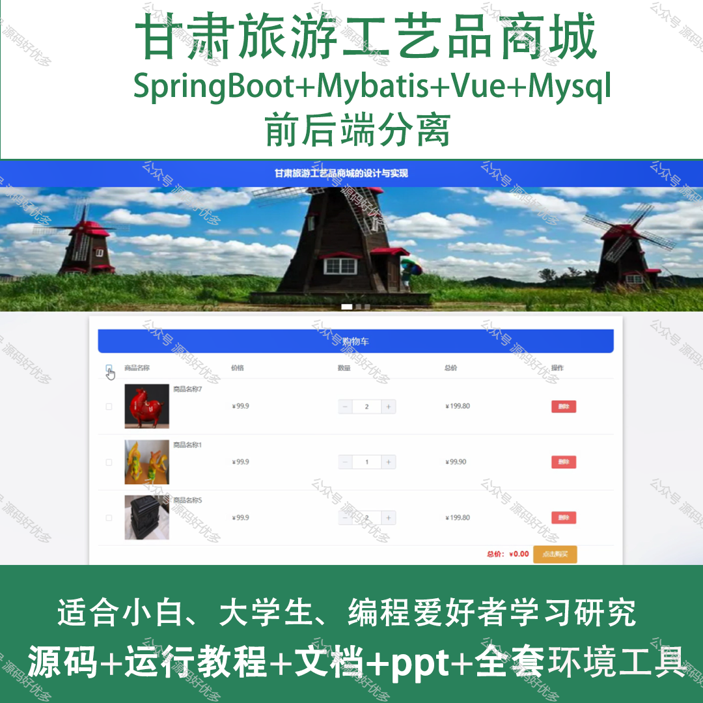
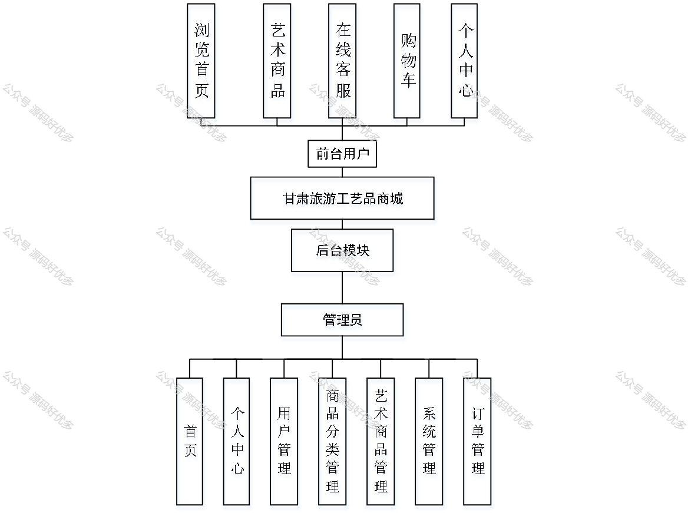
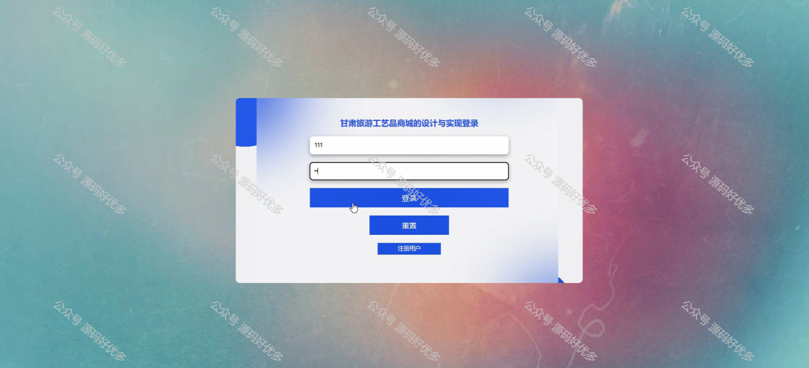
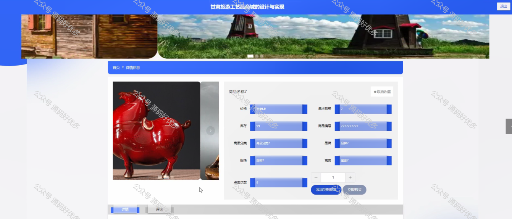
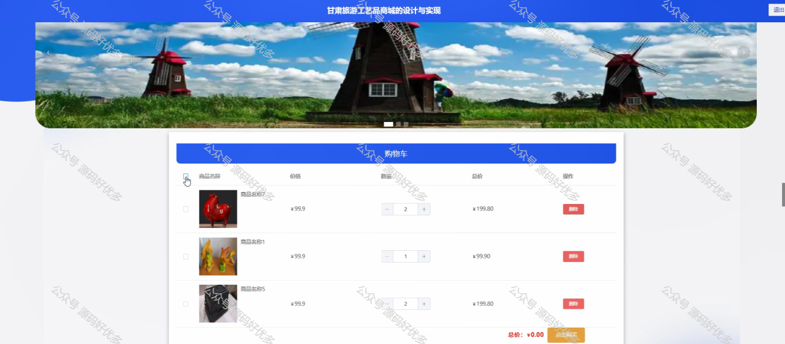
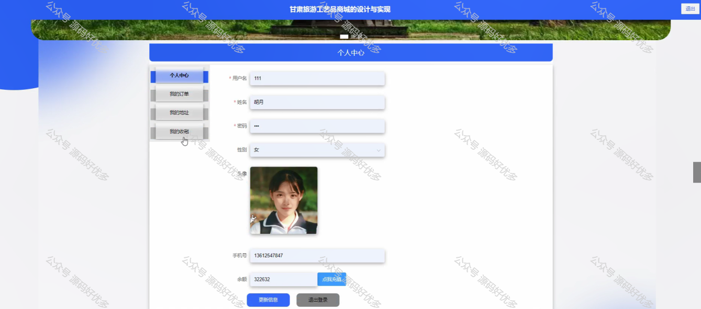
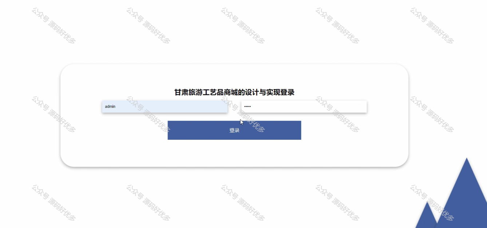
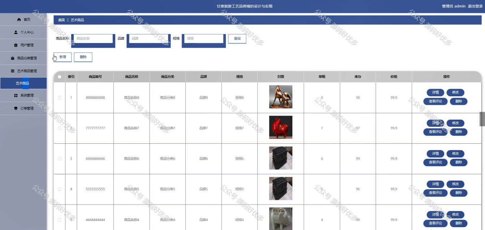
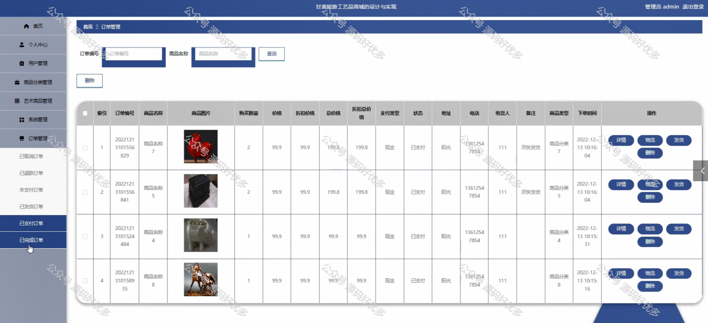
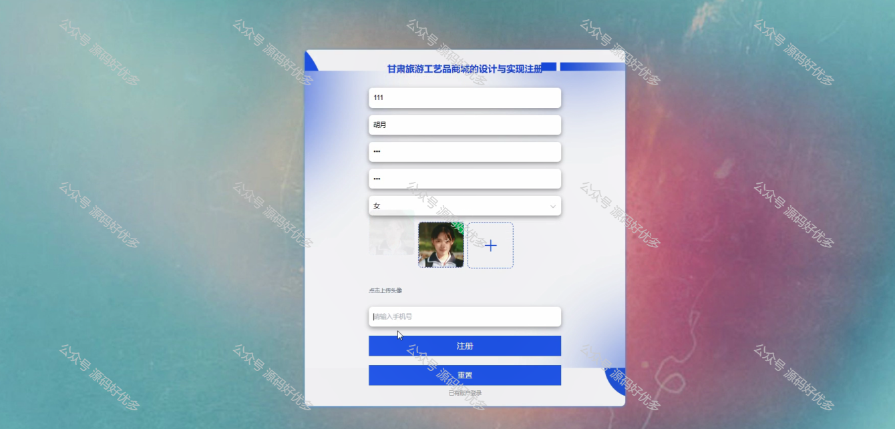
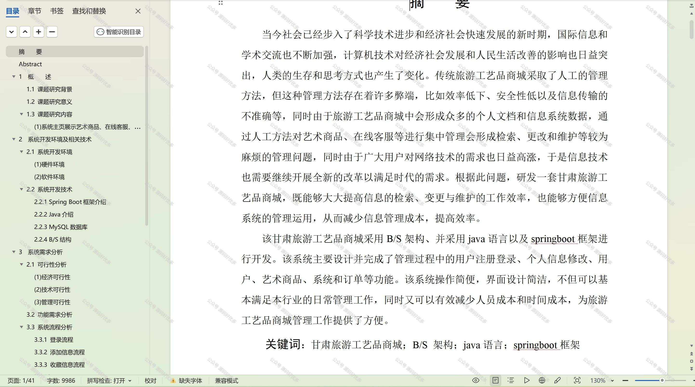

  
